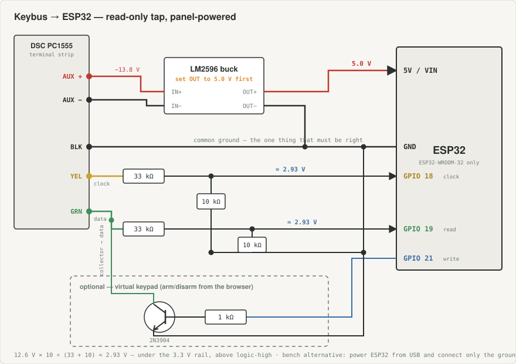

# DSC PC1555MX Keybus interface — ESP32 + macOS

Reads a DSC PC1555MX (Power632) PowerSeries panel over its Keybus and exposes zone,
arming, and trouble state — first over USB serial, then as a self-hosted web page on
your LAN. No cloud, no broker, no subscription.

- [`docs/panel-bringup.md`](docs/panel-bringup.md) — **start here if the panel has been sitting unpowered** — staged diagnostics
- [`docs/multimeter-basics.md`](docs/multimeter-basics.md) — **never used a multimeter?** read this first; procedures P1–P4 that the other docs reference
- [`docs/wiring.md`](docs/wiring.md) — hardware, resistor divider, parts list
- [`docs/pc1555mx-programming.md`](docs/pc1555mx-programming.md) — installer programming sections
- [`docs/diy-zone-reader.md`](docs/diy-zone-reader.md) — fallback if the panel is dead: read zone loops directly, Konnected-style

## Two things in your original notes to fix before you buy parts

1. **The pins were Arduino Uno pins, and one was wrong.** On the Uno the library uses
   clock 3, read **5**, write **6** — pin 4 is `dscPC16Pin`, for DSC *Classic* panels
   only, which the PC1555MX is not. On ESP32 it's **clock 18, read 19, write 21**.
2. **An ESP32 cannot be powered from Aux(+) directly.** The buck converter is
   mandatory, not "or just power it separately". Set it to 5.0 V with a meter first.

The 33k/10k dividers you had are right.

## macOS setup

```bash
brew install platformio            # or: use the PlatformIO IDE extension in VS Code
cd ~/Documents/projects/personal/security
```

Find the board's serial port after plugging it in:

```bash
ls /dev/cu.*
```

You want `/dev/cu.usbserial-*` or `/dev/cu.SLAB_USBtoUART` (CP2102) or
`/dev/cu.wchusbserial*` (CH340). If nothing new appears, the board's USB-UART chip
needs a driver — CH340 clones usually do on Apple Silicon. PlatformIO auto-detects
the port; if it picks the wrong one, add `upload_port = /dev/cu.usbserial-0001` to
`platformio.ini`.

> **Do not upgrade the ESP32 platform.** `platformio.ini` pins
> `espressif32@6.9.0` (arduino-esp32 2.0.x) because dscKeybusInterface does not
> compile against arduino-esp32 3.x — the timer API changed out from under it
> ([issue #344](https://github.com/taligentx/dscKeybusInterface/issues/344)).

## Upstream maintenance status

Checked 2026-09-06:

| Repo | Last commit | State |
|---|---|---|
| [taligentx/dscKeybusInterface](https://github.com/taligentx/dscKeybusInterface) | **2022-03-18** ("Release 3.0") | Frozen. 49 open issues, recent ones unanswered. |
| [Dilbert66/esphome-components](https://github.com/Dilbert66/esphome-components) | **2026-09-05** | Active — merging outside PRs. |
| [Dilbert66/esphome-dsckeybus](https://github.com/Dilbert66/esphome-dsckeybus) | **2026-08-24** | Active. |

The upstream library has been unmaintained for four and a half years. That is less
alarming than it sounds: the Keybus protocol and your 1990s-era panel are both frozen
targets, so the decoding logic doesn't rot. The only thing that rots is the boundary
with the ESP32 toolchain — which is precisely what the platform pin above handles.

None of upstream's 12 forks has become a maintained successor. Note especially
`ppakotze/dscKeybusInterface`, whose repo description reads "Fix ESP32 timer compile
errors" — its commit history is byte-identical to upstream and contains no such fix.
A fork existing is not the same as a fix existing.

Dilbert66's project is the real successor. It carries a heavily modified copy of the
same library and tracks current ESPHome, and it is not ESPHome-only: the
`Mqtt_Example/` directory in `esphome-dsckeybus` is a plain Arduino sketch built on
his maintained core, so the current code is reachable without adopting ESPHome.

## Toolchain options

Pinning the platform is what this repo does, but it isn't the only way out of the
arduino-esp32 3.x problem.

| Option | Trade-off |
|---|---|
| **Pin `espressif32@6.9.0`** (this repo) | Simplest. You write C++ and own every line. Toolchain is frozen — no new ESP32 core fixes. |
| **[Dilbert66/esphome-dsckeybus](https://github.com/Dilbert66/esphome-dsckeybus)** | A heavily modified fork of the same library packaged as an ESPHome external component, actively maintained into 2026 — so it tracks the *current* esp32 core, no pinning. Adds zone-expander emulation (up to 64 zones), PGM relay outputs, NTP panel time sync, and full keypad menu text. You write YAML instead of C++. Different pins: clock 22, read 21, write 18. Dropped ESP8266 as of ESPHome 2025.7. |
| **Patch the timer calls yourself** | ~20 lines in the library's esp32 timer setup (`timerBegin()` signature, `timerAlarmEnable/Disable` → `timerAlarm`). Frees you from the pin, but now you maintain a fork. |
| **ESP8266 instead** | Sidesteps the issue entirely — separate Arduino core, never broke. But less RAM, and the actively-maintained fork no longer supports it. Not worth choosing in 2026. |
| **Envisalink 4** | Commercial DSC interface board, no soldering, works with Home Assistant out of the box. ~10× the cost and you learn nothing. |

The ESPHome route does **not** require Home Assistant — ESPHome's `web_server`
component serves its own standalone LAN page, which covers what you asked for. It is
built around HA though, so the standalone path is the less-travelled one.

## Milestone 1 — serial

Wire clock, data, and ground per `docs/wiring.md`. Skip the transistor for now.



```bash
pio run -e serial -t upload -t monitor
```

Expected within a few seconds:

```
Keybus connected
Partition 1: Ready
Panel version: 32
```

Then walk around opening doors — you should see `Zone opened: 1`, `Zone restored: 1`.
If you get nothing, or garbage, the wiring is the problem 95% of the time: check the
divider values, and resolder anything that's on a breadboard.

## Milestone 2 — web page

```bash
cp include/secrets.h.example include/secrets.h
$EDITOR include/secrets.h          # WiFi SSID + password
$EDITOR src/web_status.cpp         # zoneNames[] — name your actual zones
pio run -e web -t upload -t monitor
```

Open `http://dsc.local/` — or the IP printed on serial if mDNS is flaky on your
network. The page polls `/api/status` every 1.5 s and shows arming state, per-zone
open/closed, AC power, battery, trouble, and the panel's own clock.

`/api/status` returns plain JSON, so it's easy to scrape later if you change your mind
about Home Assistant.

### Virtual keypad (optional, do it last)

Arming and disarming from the browser needs the NPN transistor from `docs/wiring.md`,
plus uncommenting `#define ENABLE_VIRTUAL_KEYPAD` in `src/web_status.cpp`.

Think about this before you enable it. The page has **no authentication** — anything
on your LAN can disarm your house. Options, roughly in order of effort: leave it
read-only; put the ESP32 on an IoT VLAN; or add HTTP basic auth
(`server.authenticate()`) and accept that it's plaintext over HTTP.

## Panel-side programming

See [`docs/pc1555mx-programming.md`](docs/pc1555mx-programming.md) for the full
section reference. The one change the interface actually wants:

```
[*][8][5555]  →  370  →  000 000 000 000 000  →  [#]
```

That disables swinger shutdown (which otherwise stops the panel reporting a zone
after 3 alarms in one armed cycle — the interface stops seeing them too) and makes AC
power loss report immediately instead of after 30 minutes.

**If this panel is monitored, put the account on test with the central station first.**

## Verification status

**Both targets compile clean** — verified 2026-09-07 with PlatformIO 6.1.19 against
the pinned `espressif32@6.9.0` and `dscKeybusInterface@3.0.0`:

```
pio run -e serial   → SUCCESS   RAM 7.2%, flash 21.9%
pio run -e web      → SUCCESS
```

The sketches are written against the library's published v3.0 API — every field used
(`dsc.armedStay[]`, `dsc.openZones[]`, `dsc.keybusConnected`, `dsc.panelVersion`, …)
is taken from the upstream `examples/esp32/Status/Status.ino`. Not yet tested against
a live panel — that's stage 6 of `docs/panel-bringup.md`.

## References

- [taligentx/dscKeybusInterface](https://github.com/taligentx/dscKeybusInterface) — the library; PC1555MX is explicitly on its tested list
- [Issue #344 — arduino-esp32 3.x incompatibility](https://github.com/taligentx/dscKeybusInterface/issues/344)
- [DSC PC1555 installation manual](https://www.manualslib.com/manual/2391841/Dsc-Pc1555.html)
